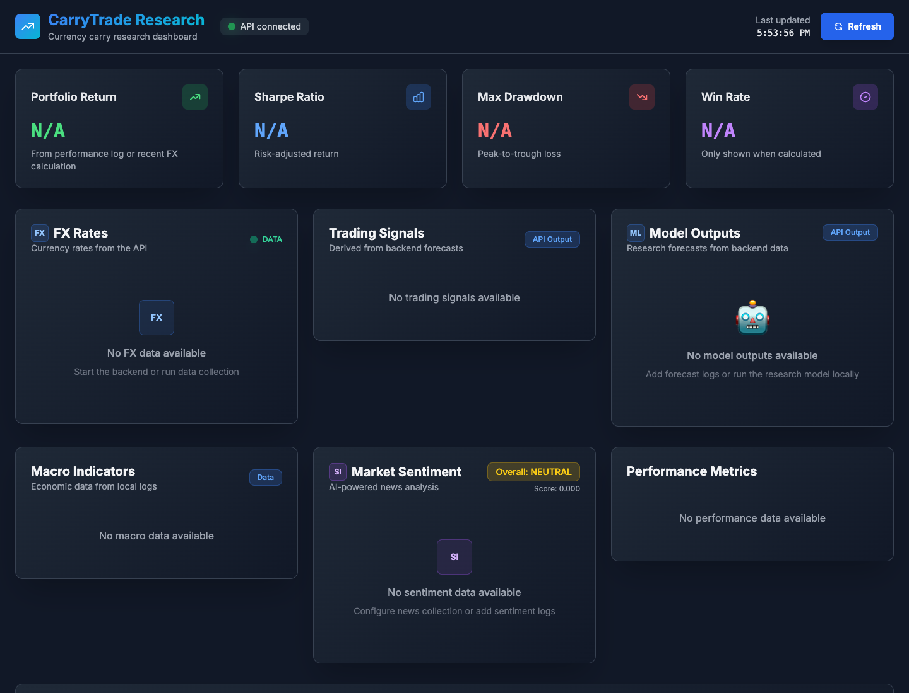

# Carry Trade Research Model

[](https://github.com/Aidan2111/carry-trade-model/actions/workflows/ci.yml)
[](https://github.com/Aidan2111/carry-trade-model/actions/workflows/security.yml)
[](https://github.com/Aidan2111/carry-trade-model/releases/latest)
[](LICENSE)
[](pyproject.toml)

A Python and React research project for exploring currency carry trade signals, FX data collection, macro indicators, news sentiment, and dashboard-driven analysis.

Built by [Aidan Marshall](https://aidanmarshall.ai/), a Dallas-based AI engineer focused on agentic AI systems, enterprise automation, and applied AI engineering.

This repository is intentionally framed as a research and engineering project, not a trading product. The current public-facing flow favors traceable data, explicit fallbacks, and honest labels over inflated claims.

## Verified Evidence

The repository keeps its strongest claims tied to commands that run offline or
with deterministic fixtures:

- **API contract:** `python scripts/system_evaluation.py` verifies the health
  route, real-data dashboard schema, canonical key style, and the default-off
  model-update gate.
- **Model validation:** `python -m unittest tests.test_model_validation`
  verifies forward seven-day target construction, no-skill behavior on pure
  noise, and recovery of a planted signal.
- **Frontend:** `npm ci && npm run build` type-checks the React/TypeScript app
  and produces the Vite production bundle.
- **Portability and security:** CI covers Python 3.11-3.13 plus Windows, while
  scheduled jobs audit Python and npm dependencies and scan repository history
  for secrets.

These checks establish software and evaluation behavior; they are not an investment-performance claim, a live-trading result, or evidence that the
research model will generalize to future markets. See the current
[evaluation record](docs/reports/EVALUATION_RESULTS.md) for the exact boundary.



The screenshot is a local development capture with the API connected and no
research logs loaded. The explicit empty states are intentional: the dashboard
does not manufacture market, prediction, or performance data for a demo.

## Why This Project Exists

I started this project in college as a finance major, before dedicated coding assistants such as Codex, Claude Code, or similar agentic tools existed. It began as a simple attempt to write code with early ChatGPT help for a carry trade idea. Over time, as my engineering skills improved, I kept expanding it into a broader system with data collection, model experimentation, API endpoints, and a React dashboard.

That history is part of the value proposition: this is a finance-origin project that grew into a practical software engineering artifact. It shows the progression from quantitative curiosity to a more disciplined system with tests, docs, data provenance, and public-release hygiene.

## What It Does

- Collects FX data for carry trade research using Yahoo Finance and optional API integrations.
- Reads macro and news sentiment logs when available.
- Provides a Flask API for dashboard consumption.
- Displays FX rates, sentiment, macro data, model outputs, signals, and performance metrics in a React dashboard.
- Includes improved model experiments using time-series validation and optional boosted-tree models.
- Keeps older exploratory scripts for historical context while documenting the current canonical path.

## Data Provenance

Data provenance is explicit in the public-facing flow. The repository separates real inputs from derived or unavailable outputs:

- FX rates: pulled from Yahoo Finance where available, with optional API fallbacks in the data collection scripts.
- News sentiment: computed from local news logs and optional NewsAPI collection when `NEWS_API_KEY` is configured.
- Macro data: read from local macro logs where available; optional FRED usage is supported by separate scripts.
- Predictions and signals: research heuristics unless you add trained model outputs to the expected log files.
- Performance metrics: shown only when a `logs/performance_log.csv` file exists. The API no longer invents portfolio performance numbers when no performance data is available.

### Data Source Tiers

Free/no-key data is enough to run the project for fun, demos, and local research:

- Yahoo Finance via `yfinance` for FX rates where available.
- ExchangeRate-API public endpoint for basic FX fallback data.
- RSS feeds for broad financial headlines.
- Local CSV logs that you create by running the collectors.

Optional free API keys improve coverage without requiring paid plans:

- `NEWS_API_KEY` enables richer headline collection from NewsAPI.
- `FRED_API_KEY` enables official macro series from FRED.
- `ALPHA_VANTAGE_API_KEY` enables another FX source.
- `CURRENCY_API_KEY` enables CurrencyAPI as an additional FX source.

Paid or premium data is not required, but it is better for serious research:

- `FIXER_API_KEY` or other paid FX providers can improve reliability, quotas, and coverage.
- Professional macro/news/market-data feeds usually have cleaner licensing, better uptime, and better historical depth.
- Higher-quality data usually comes from paid providers; free sources are good enough to explore the system but should not be treated as institutional-grade inputs.

If a source is unavailable or a key is missing, the public API returns empty or `null` data for that slice instead of making up values.

Not financial advice. This software is for research, education, and portfolio demonstration only.

## Current Public-Ready Entry Points

Use these files first:

- `api_server_real_data.py` - root compatibility wrapper for the Flask app factory and routes in `src/carry_trade/api/`.
- `frontend/` - React TypeScript dashboard.
- `enhanced_scraper_simple.py` - root compatibility wrapper for the practical data collector in `src/carry_trade/data/collectors/`.
- `improved_ensemble_model.py` - root compatibility import for the model code in `src/carry_trade/modeling/experiments/`.
- `tests/test_public_readiness.py` - release hygiene checks for secrets, dashboard data wiring, env docs, and README positioning.
- `tests/test_model_validation.py` - model-theory checks: forward-looking target construction, no-skill-on-noise leakage detection, and planted-signal recovery.

Several older scripts remain in `archive/legacy/` and `docs/reports/` to show project history. Treat them as exploratory unless the README calls them out above.

## Author

- Website: [aidanmarshall.ai](https://aidanmarshall.ai/)
- GitHub: [Aidan2111](https://github.com/Aidan2111)
- LinkedIn: [Aidan Marshall](https://www.linkedin.com/in/aidan-marshall77)

## Repository Layout

The project uses a `src/carry_trade/` package so current implementation code is grouped by responsibility:

- `src/carry_trade/api/` - Flask API implementation.
- `src/carry_trade/data/collectors/` - local data collectors and historical import scripts.
- `src/carry_trade/data/sources/` - shared low-level source clients such as NewsAPI.
- `src/carry_trade/data/providers/` - optional premium provider clients.
- `src/carry_trade/data/runtime/` - runtime data-engine components.
- `src/carry_trade/modeling/experiments/` - research model experiments.
- `src/carry_trade/modeling/runners/` - runnable model workflows used by the dashboard.
- `src/carry_trade/modeling/backtests/` - historical backtests.
- `src/carry_trade/dashboard/` - dashboard log integration.
- `src/carry_trade/trading/` - paper-only trading research scaffold.
- `docs/architecture/repository-structure.md` - detailed layout rationale and Microsoft Learn references.
- `docs/process/branching-strategy.md` - branch naming, PR, and quality-gate rules.
- `docs/dashboard.md` - dashboard setup and endpoint notes.

## Quick Start

### Prerequisites

- Python 3.11 or newer.
- Node.js 20.19 or newer for the Vite dashboard.
- Git.
- macOS only, for XGBoost/LightGBM: `brew install libomp` if you want boosted-tree models. Without `libomp`, the improved model falls back to scikit-learn estimators.

### Backend Setup

#### Install for use

Install the current tagged backend wheel without an editable checkout:

```bash
python -m pip install \
  https://github.com/Aidan2111/carry-trade-model/releases/download/v0.1.0/carry_trade_model-0.1.0-py3-none-any.whl
carry-trade-api
```

#### Contributor setup

```bash
git clone https://github.com/Aidan2111/carry-trade-model.git
cd carry-trade-model

python3 -m venv .venv
source .venv/bin/activate
python -m pip install --upgrade pip setuptools wheel
python -m pip install -e .
```

The default installation covers the API, deterministic model runner, and model
validation path. Install data collectors and optional boosted-tree backends
when you need them:

```bash
python -m pip install -e ".[data]"     # external data collectors/providers
python -m pip install -e ".[boosted]"  # LightGBM and XGBoost
python -m pip install -e ".[all]"      # every supported runtime feature
```

Optional API keys:

```bash
cp .env.example .env
# Fill in optional keys only for the providers you want to use.
```

### Run The API

```bash
source .venv/bin/activate
carry-trade-api
```

`python api_server_real_data.py` remains available as a compatibility command
for existing checkouts.

The API runs at `http://127.0.0.1:8000` by default. Use `FLASK_HOST`, `FLASK_PORT`, and `CORS_ORIGINS` if you intentionally expose it elsewhere.

Useful endpoints:

- `GET /health`
- `GET /api/dashboard`
- `GET /api/fx-rates`
- `GET /api/predictions`
- `GET /api/performance`

### Run The Dashboard

```bash
cd frontend
npm ci
npm start
```

The dashboard runs at `http://127.0.0.1:5173` and requests the backend at `http://localhost:8000` by default.

To use another backend URL:

```bash
VITE_API_URL=http://localhost:8000 npm start
```

## Verification

Run the public-readiness and model-validation checks:

```bash
source .venv/bin/activate
.venv/bin/python -m unittest discover -s tests -v
```

Build and validate the Python distribution:

```bash
.venv/bin/python -m pip install -e ".[all,dev]"
.venv/bin/python -m build
.venv/bin/python -m twine check dist/*
```

Run Python compile checks:

```bash
find . -path './.venv' -prune -o -path './frontend/node_modules' -prune -o -path './frontend/dist' -prune -o -path './frontend/build' -prune -o -name '*.py' -print0 | xargs -0 .venv/bin/python -m py_compile
```

Run the deterministic API system evaluation:

```bash
.venv/bin/python scripts/system_evaluation.py
```

Run the frontend production build:

```bash
cd frontend
npm run build
```

Run the full frontend dependency audit:

```bash
cd frontend
npm audit
```

The frontend uses Vite and commits `frontend/package-lock.json` for reproducible installs.

### Package publication

GitHub releases are the current distribution source. The manual
`.github/workflows/publish-pypi.yml` workflow is ready for PyPI trusted
publishing after a maintainer registers the repository, workflow, and `pypi`
environment with PyPI. It validates the requested tag, reruns tests, builds and
checks the artifacts, and publishes through OpenID Connect without a stored API
token. Do not use `pip install carry-trade-model` until that workflow has
completed successfully for a release.

## Repository Hygiene

- API keys are read from `.env` and environment variables, not committed source.
- `.env.example` documents optional keys.
- Runtime logs, CSVs, model binaries, virtual environments, node modules, and build output are ignored.
- `pyproject.toml` is the canonical Python dependency manifest; `requirements.txt` remains for tooling that expects a requirements file.
- Runtime dependencies use compatible bounds; install optional extras instead
  of pulling every data and boosted-model package into the default API setup.
- Branch and PR expectations are documented in `docs/process/branching-strategy.md`.
- If this repository was previously private and contained committed keys in old history, rotate those keys before making the repository public.

## Suggested Project Narrative

This is a good recruiter-facing story:

> I started this as a finance-major carry trade model in college before modern coding assistants existed. It began as a rough early-ChatGPT coding experiment and became a more mature engineering project as I learned to build data pipelines, model validation, APIs, and frontend dashboards. The public version is intentionally honest about provenance, limitations, and what is research-grade versus production-grade.

## Limitations

- This is not a live trading system.
- Predictions and signals should be treated as research outputs.
- Some older files are preserved as project history and are not the recommended entry point.
- External data availability depends on providers, API keys, quotas, and local logs.

## Project policies

- [Contributing](CONTRIBUTING.md)
- [Security policy](SECURITY.md)
- [Support](SUPPORT.md)
- [Governance](GOVERNANCE.md)
- [Changelog](CHANGELOG.md)
- [Financial disclaimer](DISCLAIMER.md)

## License

MIT. See `LICENSE`. The separate research and financial-use limitations are
described in `DISCLAIMER.md`.
